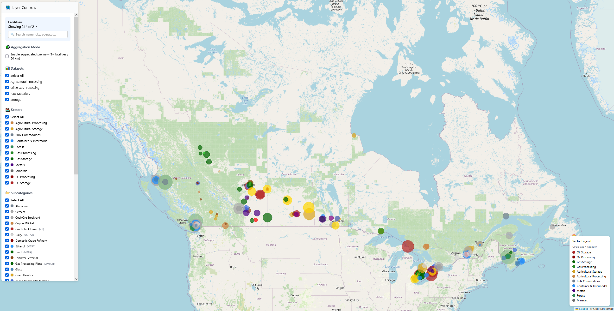

# 🇨🇦 Canada Industrial Capacity Visualization

An interactive **web-based visualization** of Canada's industrial infrastructure — showing storage, processing, and manufacturing facilities across energy, agriculture, forestry, and materials sectors.  
The map aggregates facilities by type, capacity, and geography, allowing exploration of national-scale patterns and local details.

---

## 🖼️ Preview

**Interactive map example:**



> Demo Site:[https://sam10155.github.io/Map-Data-Visulization/](https://sam10155.github.io/Map-Data-Visulization/)

---

## 🌍 Features

- 🗺️ **Interactive Leaflet Map** — zoomable, color-coded markers by capacity  
- 🧩 **Aggregation Mode (Pie View)** — pie chart aggregation [50km|Provinces|Regions]  
- 🔍 **Search** — find facilities by name, city, or operator  
- 🧮 **Filters** — by dataset, sector, or subcategory (with unit hints)  
- 📊 **Capacity Scaling** — marker radius scales by reported capacity  
- ⬇️ **CSV Export** — download visible facilities directly from the map  

---

## 📂 Repository Structure

```
Visualization/
├── index.html                  # Main web interface
├── css/
│   └── style.css               # Layout and UI styling
├── js/
│   ├── main.js                 # Application entry point
│   ├── map.js                  # Map initialization & marker logic
│   ├── filters.js              # Dataset / sector / subcategory filtering
│   ├── ui.js                   # Control panel, legend, aggregation toggle
│   ├── constants.js            # Color maps, units, etc.
│   ├── aggregate.js            # City-level pie-chart aggregation logic
│   ├── search.js               # Search box & filtering integration
│   └── download.js             # CSV export
├── data/
│   └── canada-data.js          # Core dataset (all facilities)
├── serve.py                    # Simple local HTTP server (with JS MIME types)
└── README.md
```

---

## ⚙️ Local Setup

### 1. Clone the repository
```bash
git clone git@github.com:sam10155/Map-Data-Visulization.git
cd Map-Data-Visulization
```

### 2. Run a local web server
Use the provided helper (ensures correct MIME types on Windows/macOS/Linux):
```bash
python serve.py
```
Or start a simple server manually (Python 3):
```bash
python -m http.server 8080
```

### 3. Open the app
```
http://localhost:8080/
```

> **Note:** If you see console warnings like “MIME type text/plain is not a valid JavaScript MIME type,” use `serve.py` (it sets `Content-Type: application/javascript`) or serve via any static server that sends correct MIME types.

---

## 🧱 Data Model

Each facility entry in `data/canada-data.js` follows this structure:

```js
{
  name: 'Enbridge Sarnia Terminal',
  operator: 'Enbridge',
  sector: 'Oil Storage',
  subcategory: 'Crude Tank Farm',
  province: 'ON',
  city: 'Sarnia',
  lat: 42.960,
  lon: -82.404,
  capacity: 2000000,
  unit: 'bbl'
}
```

The module exports:
- `storageData`
- `oilGasProcessingData`
- `rawMaterialsProcessingData`
- `agriProcessingData`
- `allFacilities` (combined)

And exposes `window.canadaIndustrialData = { storage, oilGasProcessing, rawMaterials, agriProcessing, all }` for the browser.

---

## 🧭 Controls Overview

| Control | Description |
| --- | --- |
| **Search** | Filters markers by name, operator, or city (live) |
| **Aggregation Mode** | Toggles city-level pie charts for clusters (3+ facilities within 50 km) |
| **Datasets** | Toggle major datasets (Storage, Oil & Gas Processing, Raw Materials, Agricultural Processing) |
| **Sectors** | Toggle high-level industrial sectors (Oil Processing, Gas Processing, Metals, Forest, etc.) |
| **Subcategories** | Fine-grained type filters (shows unit hints like `bbl/d`, `MMcf/d`, `MTPA`) |
| **Download Visible Facilities** | Exports the current filtered view to CSV |

---

## 🧰 Tech Stack

- **Frontend:** HTML5, CSS3, Vanilla JavaScript  
- **Map Engine:** [Leaflet.js](https://leafletjs.com/) + OpenStreetMap tiles  
- **Data Format:** Static JavaScript arrays (no backend)  
- **Local Server:** Python 3 (`serve.py`) for proper JS/CSS MIME types

---

## 🚀 Roadmap

- [ ] Optional dark/satellite basemaps  
- [ ] Export to GeoJSON / Shapefile  
- [ ] Convert Tableview to 1/3 screen map overlay 
- [ ] Live enrichment via open government/regulator data portals  

---

## 📜 License

**MIT License © 2025 Samuel Pacheco**  
Feel free to fork, adapt, and reuse with attribution.

---
